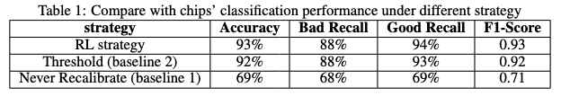
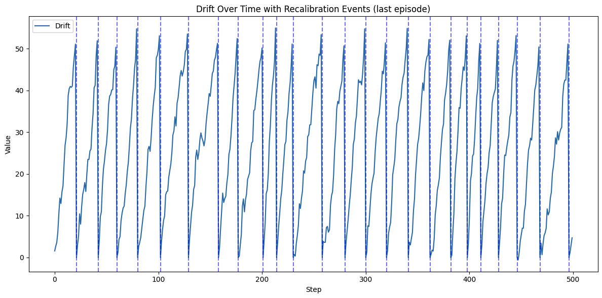

# 🔬 ATE Drift Prediction and Recalibration using Reinforcement Learning

This project simulates an Automated Test Equipment (ATE) environment where chip quality degrades over time due to drift. The goal is to build a reinforcement learning (RL) agent that predicts when to recalibrate to maintain high classification performance while minimizing downtime.

📄 [View Full Report (PDF)](project-report.pdf)  
📓 [View Code](ATE-drift-prediction.ipynb)

---

## 🎯 Problem Overview

Traditional ATE systems suffer from accuracy loss due to long-term drift. Baseline approaches either:
- Never recalibrate → accuracy drops
- Threshold-based recalibration - a little bit lower accuracy

This project implements an RL agent that learns when to trigger recalibration to balance cost and quality.

---

## 📈 Performance Comparison

🧪 Model performance against two baselines is shown below:

---

## 📉 Drift Behavior over Time

The RL agent successfully learns to recalibrate in a certain range of the drift:

- 🔵 **Blue Dashed Line**: Recalibration occurred on time  
- 🟢 **Green Dashed Line**: Recalibration occurred too early  
- 🔴 **Red Dashed Line**: Recalibration occurred too late

---

## 🧠 Key Techniques

- Custom ATE simulation environment
- Double Q-Learning implementation
- Reward engineering for balancing chip quality and calibration cost
- Matplotlib-based visualization for drift and recalibration events
