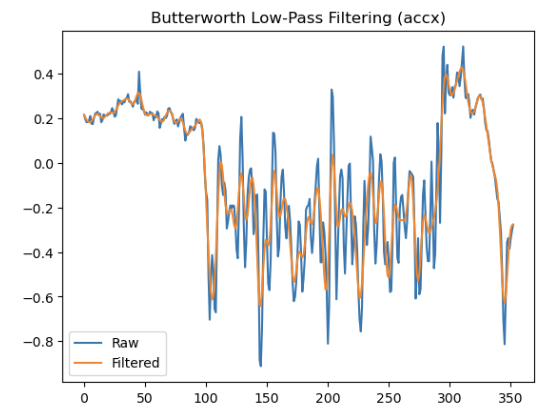
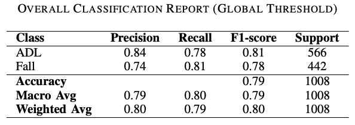
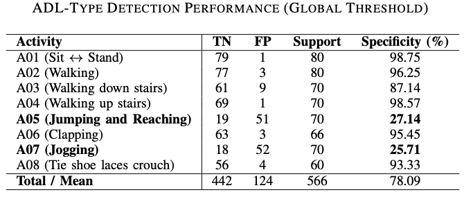
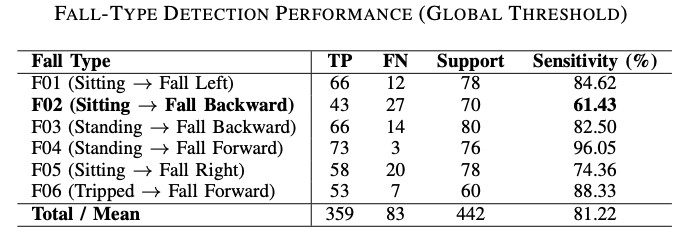

# 🚨 Fall Detection using Wrist-Worn Accelerometer Signals

This project evaluates a threshold-based fall detection framework using triaxial accelerometer data collected from the WeBe Band wearable device. The goal is to distinguish fall events from activities of daily living (ADLs) while maintaining computational efficiency suitable for real-time embedded deployment.

📄 [Download Full Paper](WeBe_Fall_Detection.pdf)

---

## 🎯 Problem Overview

Falls are a major contributor to injury and reduced quality of life, particularly among older adults. Reliable fall detection systems can help provide timely assistance and reduce the risk associated with long-lie events.

This project investigates whether a lightweight threshold-based algorithm using only wrist-worn accelerometer data can effectively distinguish falls from normal daily activities.

### Activities Included

The dataset contains six fall types and eight activities of daily living (ADLs).

**Falls**
- Sitting and Fall Left
- Sitting and Fall Backward
- Standing and Fall Backward
- Standing and Fall Forward
- Sitting and Fall Right
- Tripped and Fall Forward

**Activities of Daily Living (ADLs)**
- Sit and Stand
- Walking
- Walking Down Stairs
- Walking Up Stairs
- Jogging
- Clapping
- Jumping and Reaching
- Tie Shoe Laces Crouch

---

## 🧪 Signal Processing Pipeline

Raw accelerometer signals were first filtered using a fourth-order Butterworth low-pass filter with a cutoff frequency of 3 Hz.

The filtering process reduces sensor noise while preserving motion patterns relevant to fall detection.



The filtered signals were then used for acceleration magnitude computation and threshold-based event detection.

---

## 🧠 Threshold-Based Fall Detection

The algorithm computes the acceleration magnitude:

```math
A = \sqrt{a_x^2 + a_y^2 + a_z^2}
```

A fall is detected when the following conditions are satisfied sequentially:

1. Acceleration magnitude exceeds the impact threshold.
2. Motion remains below the motionless threshold after a post-impact period.
3. Orientation change exceeds the angle threshold.

The framework uses:

- Impact Threshold
- Motionless Threshold
- Angle Threshold
- Post-Impact Duration
- Motionless Duration

This lightweight design enables real-time execution on embedded hardware without requiring complex machine learning models.

---

## ⚙️ Threshold Optimization

To improve cross-subject generalization, threshold parameters were optimized using Optuna within a Leave-One-Out Cross-Validation (LOOCV) framework.

For each fold:

- One subject was used as the test subject.
- Remaining subjects were used for optimization.
- Optimal thresholds were recorded.
- A global threshold set was obtained by averaging thresholds across all folds.

This approach helps reduce overfitting while improving robustness across different users.

---

## 📈 Results

The final global threshold set achieved the following performance on the complete dataset:

| Metric | Value |
|----------|----------|
| Accuracy | 79% |
| ADL Precision | 84% |
| Fall Precision | 74% |
| Fall Recall | 81% |

Performance of the final threshold-based model is summarized below.



The model successfully detected most fall events while maintaining reasonable specificity against daily activities.

---

## 🔍 Activity-Level Analysis

Performance varied depending on activity type.

Falls involving strong impacts, such as standing falls and tripping events, achieved high detection rates.

Activities involving large arm movements, such as jogging and jumping, were more likely to trigger false positives due to acceleration patterns similar to falls.

The activity-level analysis is shown below.




These results highlight the challenges associated with wrist-based fall detection compared to torso-mounted sensors.

---

## 🚀 Embedded Deployment Considerations

The proposed framework was designed with embedded systems in mind.

Advantages include:

- Low computational cost
- Real-time execution
- No model training required during deployment
- Small memory footprint
- Suitable for wearable devices

This makes the approach attractive for battery-powered healthcare monitoring systems.

---

## 🧠 Key Techniques

- Triaxial Accelerometer Signal Processing
- Butterworth Low-Pass Filtering
- Threshold-Based Event Detection
- Optuna Hyperparameter Optimization
- Leave-One-Out Cross Validation (LOOCV)
- Data Augmentation
- Embedded AI Systems

