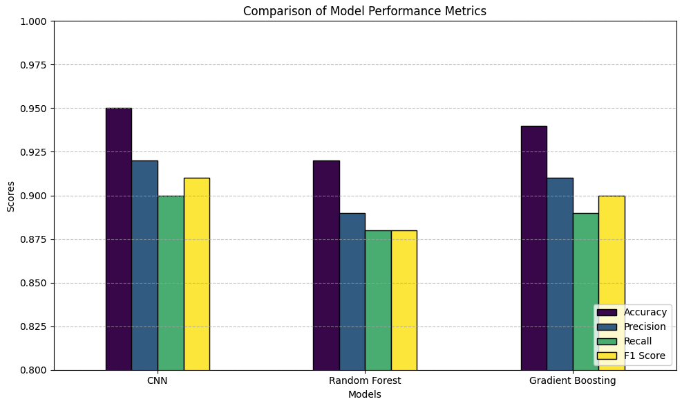
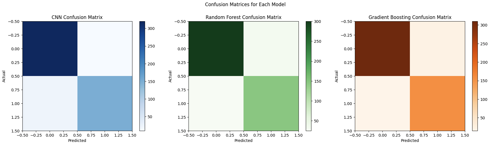

# ❤️ Arrhythmia Detection using PPG and Machine Learning

This project evaluates the performance of different machine learning models for arrhythmia detection based on photoplethysmogram (PPG) signals. The objective is to classify whether a given PPG segment indicates an arrhythmic event.

📄 [View Full Report (PDF)](project-report.pdf)  
📓 [View Code](final-project.ipynb)

---

## 🧠 Problem Overview

- Early detection of arrhythmias is essential for improving patient outcomes.
- PPG data is non-invasive and widely available, making it suitable for real-time monitoring.
- We aim to classify PPG signals using supervised machine learning models.

---

## 📚 Dataset

- Data source: **MIMIC-III Waveform Database**

---

## 📊 Model Performance Comparison

We trained and evaluated three models: **CNN**, **Random Forest**, and **Gradient Boosting**. Below is a summary of their performance:

| Model            | Accuracy | Precision | Recall | F1 Score |
|------------------|----------|-----------|--------|----------|
| CNN              | 0.95     | 0.92      | 0.90   | 0.91     |
| Random Forest    | 0.92     | 0.89      | 0.88   | 0.88     |
| Gradient Boosting| 0.94     | 0.91      | 0.89   | 0.90     |

---

## 🧾 Confusion Matrices

Visualized confusion matrices help to understand misclassifications by each model:

---

## 🛠 Key Techniques

- Direct use of labeled PPG segments from MIMIC-III
- Deep learning (CNN) and ensemble models (RF, Gradient Boosting)
- Evaluation with metrics: Accuracy, Precision, Recall, F1 Score
