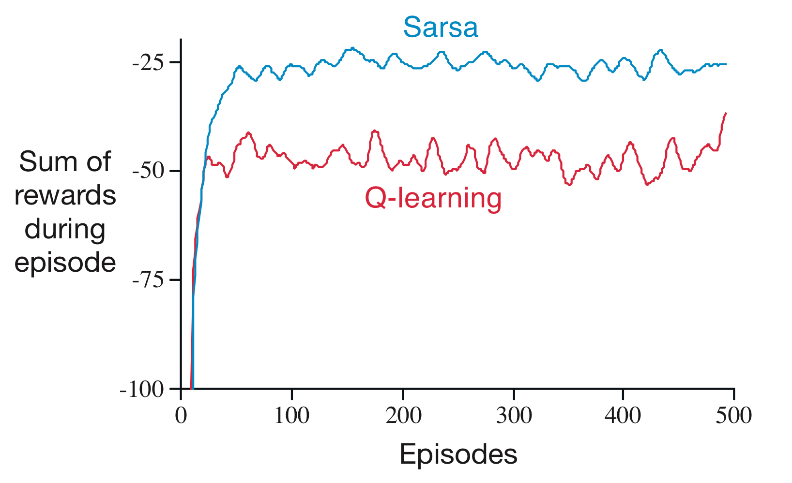
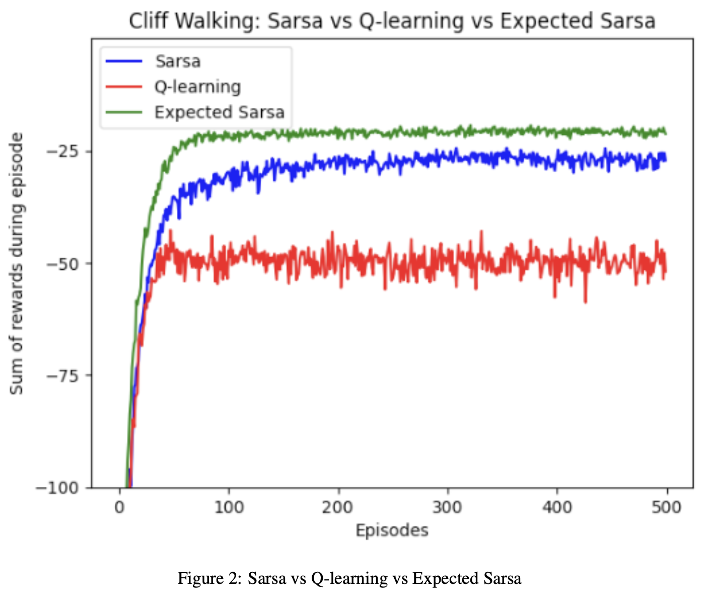

# 🧭 Cliffwalking – TD Control (Sarsa, Q-learning, Expected Sarsa)

This project reproduces **Figure 6.6** from Sutton & Barto’s *Reinforcement Learning: An Introduction* by comparing **Sarsa**, **Q-learning**, and **Expected Sarsa** on the classic **4×12 Cliffwalking** task.  
I plot **performance vs. episodes** (sum of rewards per episode) and add Expected Sarsa as a third curve, alongside Sarsa and Q-learning.

📓 [View Code](cliffwalking-td.ipynb)

---

## 🧠 Problem Overview

- **Environment:** 4×12 grid; start at bottom-left, goal at bottom-right; the bottom row between them is the **cliff**.  
- **Transitions/Rewards:** step cost `−1`; falling off the cliff yields a large negative reward (e.g., `−100`) and returns to start.  
- **Goal:** learn a control policy that maximizes expected return.

---

## 🧪 Algorithms

- **Sarsa (on-policy TD control)**  
  \[
  Q(s,a) \leftarrow Q(s,a) + \alpha \big[r + \gamma\,Q(s',a') - Q(s,a)\big]
  \]

- **Q-learning (off-policy TD control)**  
  \[
  Q(s,a) \leftarrow Q(s,a) + \alpha \big[r + \gamma\,\max_{a'} Q(s',a') - Q(s,a)\big]
  \]

- **Expected Sarsa (expected update under ε-greedy)**  
  \[
  Q(s,a) \leftarrow Q(s,a) + \alpha \big[r + \gamma\,\mathbb{E}_{a'\sim\pi_{\epsilon}}[Q(s',a')] - Q(s,a)\big]
  \]

All three use **ε-greedy** action selection to balance exploration and exploitation.

---

## ⚙️ Implementation Details

- **Initialization:** `Q` tables start at zero; the **goal state’s Q-values remain zero** by construction.  
- **Common hyperparameters:** learning rate `α`, discount `γ`, exploration `ε`.  
- **Training:** I run multiple episodes and log the **sum of rewards per episode**.  
- **Output:** a single plot with three curves (**Sarsa**, **Q-learning**, **Expected Sarsa**).

---

## 📊 Results

Reference figure from the book:

  

Results from my implementation:

  

---

## 📂 Project Structure
