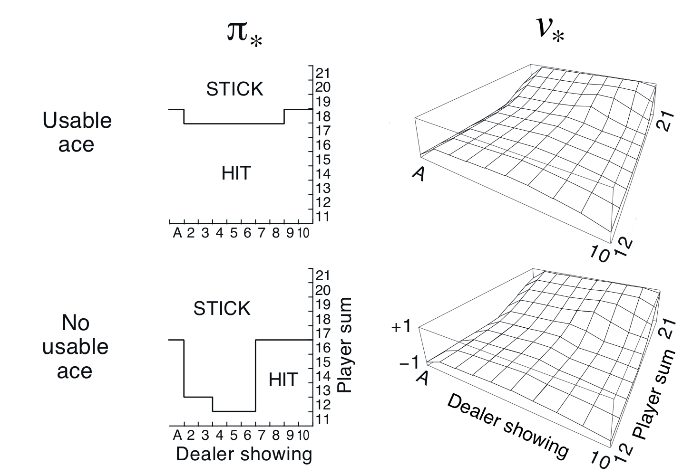
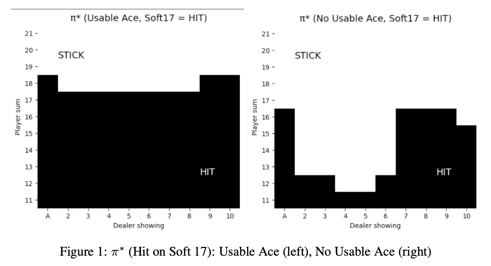
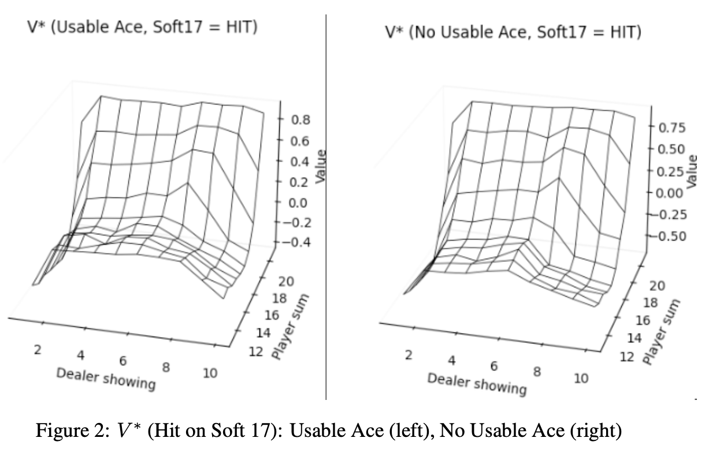
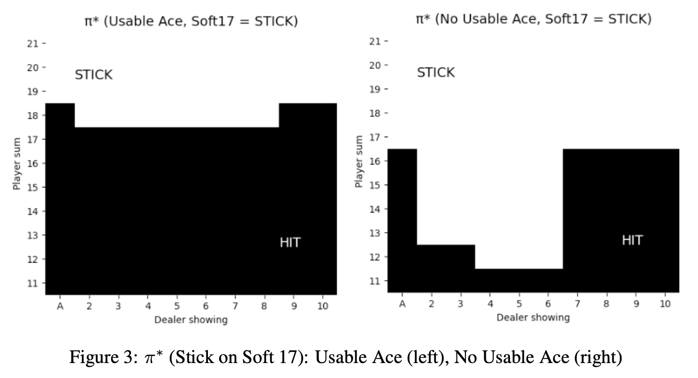
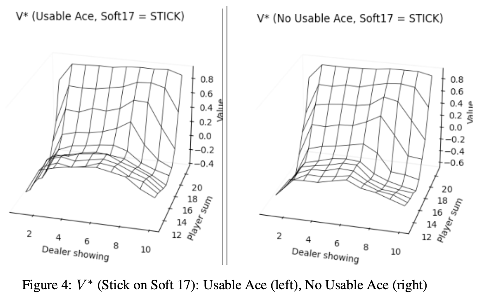

# ♠️ Blackjack – Monte Carlo Exploring Starts (MCES)

This project implements **Monte Carlo Exploring Starts (MCES)** to solve the *Blackjack* reinforcement learning problem, reproducing Figure 5.2 from Sutton & Barto's *Reinforcement Learning: An Introduction*.  
We evaluate the optimal policy (π\*) and value function (V\*) under two dealer behaviors on **soft 17**.  
Each figure contains results for both **usable Ace** and **no usable Ace**.

📓 [View Code](mces-blackjack.ipynb)

---

## 🧠 Problem Overview

- **Blackjack Rules**
  - Player starts with two cards; may **hit** or **stick** (may stick if total >= 12).
  - Dealer reveals one card and plays according to **soft-17 rules** (two cases below).
  - **Ace handling**:  
    - **Usable Ace** → Ace counts as 11 if it doesn’t cause a bust, otherwise it counts as 1.  
    - **No Usable Ace** → Ace counts as 1.  

- **Soft-17 Variants**
  1. Dealer **hits** on soft 17 (Ace+6).  
  2. Dealer **sticks** on soft 17 (Ace+6).  
     - In both cases, the dealer must stick on *soft 18* (Ace+7), *soft 19* (Ace+8), and *soft 20* (Ace+9).

- **Rewards**
  - Player bust → `-1`
  - Dealer bust → `+1`
  - Player > Dealer → `+1`
  - Player < Dealer → `-1`
  - Draw → `0`

- **Objective**  
  Learn the **optimal policy (π\*)** and **value function (V\*)** with MCES.

---

## 🛠 Implementation Details

- **Algorithm:** Monte Carlo Exploring Starts (first-visit)
- **Episodes:** 500,000
- **Exploring starts:** Random initial state–action per episode
- **Updates:** Average returns for first visits to update `Q(s, a)`
- **Policy Improvement:** Greedy w.r.t. `Q(s, a)` after updates
- **Outputs:** π\* and V\* plots for both **soft-17 variants**, each showing **usable Ace (left)** and **no usable Ace (right)**.

---

## 📊 Results

Reference figure from the textbook:

  

Results from this implementation:

  

  

  

  

