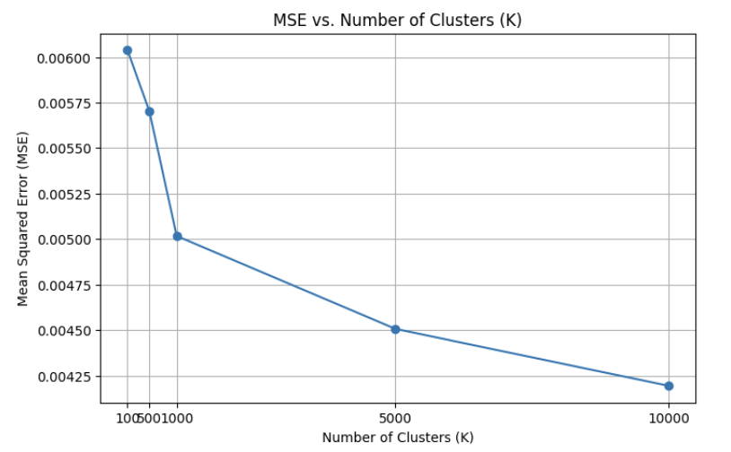
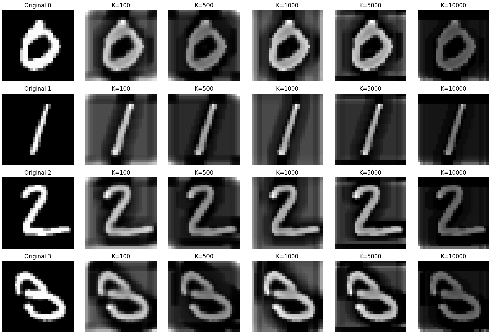
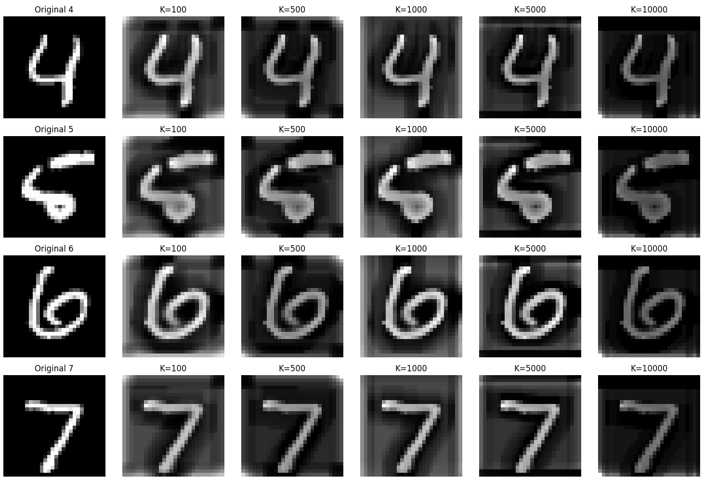
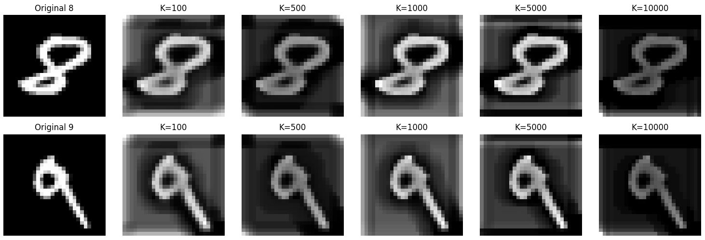

# 🔢 K-means Clustering of 5×5 MNIST Patches

This project explores **unsupervised learning** by applying **K-means clustering** to 5×5 patches extracted from the **MNIST handwritten digit dataset**.  
The goal is to study how the learned clusters evolve as \(K\) increases, and to evaluate how well digits can be reconstructed from these clusters.

📓 [View Code](mnist-patch-kmeans.ipynb)

---

## 🧠 Problem Overview

- **Dataset:** MNIST (28×28 grayscale digit images).  
- **Patch extraction:** Slide a 5×5 window across each image. Blank patches are discarded.  
- **Clustering:** Apply **K-means** to the extracted patches.  
- **Analysis goals:**
  1. Examine how clusters change as \(K\) ranges from **100 → 10,000**.  
  2. Test reconstruction of digits from the learned dictionary (cluster centers).  
  3. Evaluate reconstruction error with **patch-wise normalized MSE**.  

---

## ⚙️ Implementation Details

- **Patch preprocessing:**  
  - Extract 5×5 patches with `sklearn.feature_extraction.image.extract_patches_2d`.  
  - Discard blank patches.  
  - Flatten and normalize each patch to unit norm.  

- **Sampling:** 1,000,000 patches extracted → 100,000 sampled for clustering.  

- **Clustering:**  
  - `KMeans(n_clusters=K, random_state=42, n_init=1)`  
  - \(K = 100, 500, 1000, 5000, 10000\).  

- **Reconstruction:**  
  - Each test digit is decomposed into 5×5 patches.  
  - Each patch is matched to the nearest cluster center.  
  - Reconstructed digit is reassembled by averaging overlapping patches.  

- **Evaluation:**  
  - Patch-level normalized **Mean Squared Error (MSE)** between original and reconstruction.  
  - Visual inspection of reconstructed digits.

---

## 📊 Results

### Cluster evolution
- **K = 100** → Only broad stroke patterns are captured.  
- **K = 1,000 – 5,000** → More refined stroke variations and junctions emerge.  
- **K = 10,000** → Clusters cover nearly every possible non-blank patch, distinguishing subtle differences.

### Reconstruction error
- MSE consistently decreases with larger \(K\), confirming that more clusters improve reconstruction.  
- Improvement saturates after a few thousand clusters.  
- Reconstructions appear sharper at larger \(K\), but also **grayer** due to normalization (all patches scaled to unit norm, erasing intensity contrast).

| K       | MSE |
|---------|------|
| 100     | 0.00602 |
| 500     | 0.00570 |
| 1000    | 0.00501 |
| 5000    | 0.00450 |
| 10000   | 0.00423 |

   
  <em>MSE decreases as the number of clusters increases, with diminishing returns beyond ~5000.</em>

### Example reconstructions

Below are original MNIST digits and their reconstructions from patch-based clustering at different values of \(K\):

   
  <em>Digits 0–3 reconstructed with K = 100, 500, 1000, 5000, 10000</em>

   
  <em>Digits 4–7 reconstructed with K = 100, 500, 1000, 5000, 10000</em>

   
  <em>Digits 8–9 reconstructed with K = 100, 500, 1000, 5000, 10000</em>

