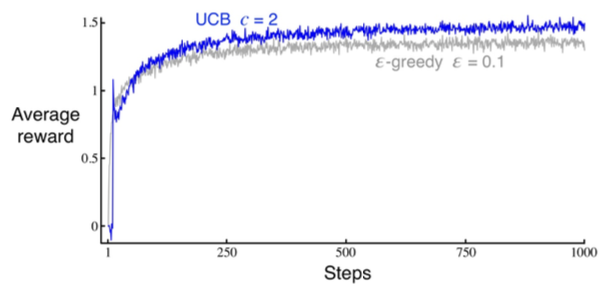
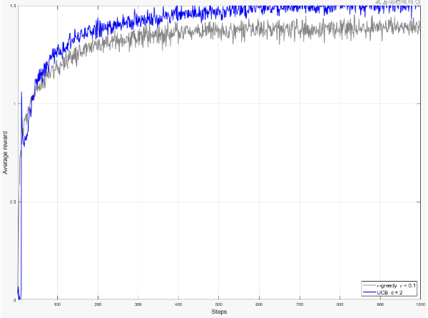

# 🎰 Multiarmed Bandit – Epsilon-Greedy & UCB in MATLAB

This project implements **epsilon-greedy** and **Upper Confidence Bound (UCB)** algorithms to solve the *multiarmed bandit* problem, reproducing Figure 2.4 from Sutton & Barto's *Reinforcement Learning: An Introduction*.  
The goal is to compare the performance of both strategies in terms of average reward over time.

📓 [View Code](multiarmed_bandit.m)

---

## 🧠 Problem Overview

- The multiarmed bandit problem models the trade-off between **exploration** (trying new actions) and **exploitation** (choosing the best-known action).
- In this experiment, we simulate a k-armed bandit and evaluate:
  - **Epsilon-Greedy**: Selects a random action with probability ε; otherwise, chooses the action with the highest estimated reward.
  - **UCB**: Selects the action maximizing  
    `Q_t(a) + c * sqrt( ln(t) / N_t(a) )`
    which balances estimated reward and uncertainty.

---

## 🛠 Implementation Details

- **Language:** MATLAB  
- **Steps per run:** 1000  
- **Runs:** 2000  
- **Parameters:**  
  - `epsilon`: exploration rate for epsilon-greedy  
  - `c`: confidence level for UCB  
- **Value updates:** Incremental formula to avoid storing full history.

---

## 📊 Results

Below is the reference figure from the textbook, followed by the figure generated by my MATLAB code.

   
  <em>Figure from Book – Expected result from Sutton & Barto (Fig. 2.4)</em>

   
  <em>Figure from Code – Result from my MATLAB implementation</em>

| Algorithm       | Key Strength                         |
|-----------------|--------------------------------------|
| Epsilon-Greedy  | Simple and effective for small tasks |
| UCB             | Better long-term performance by reducing unnecessary exploration |
