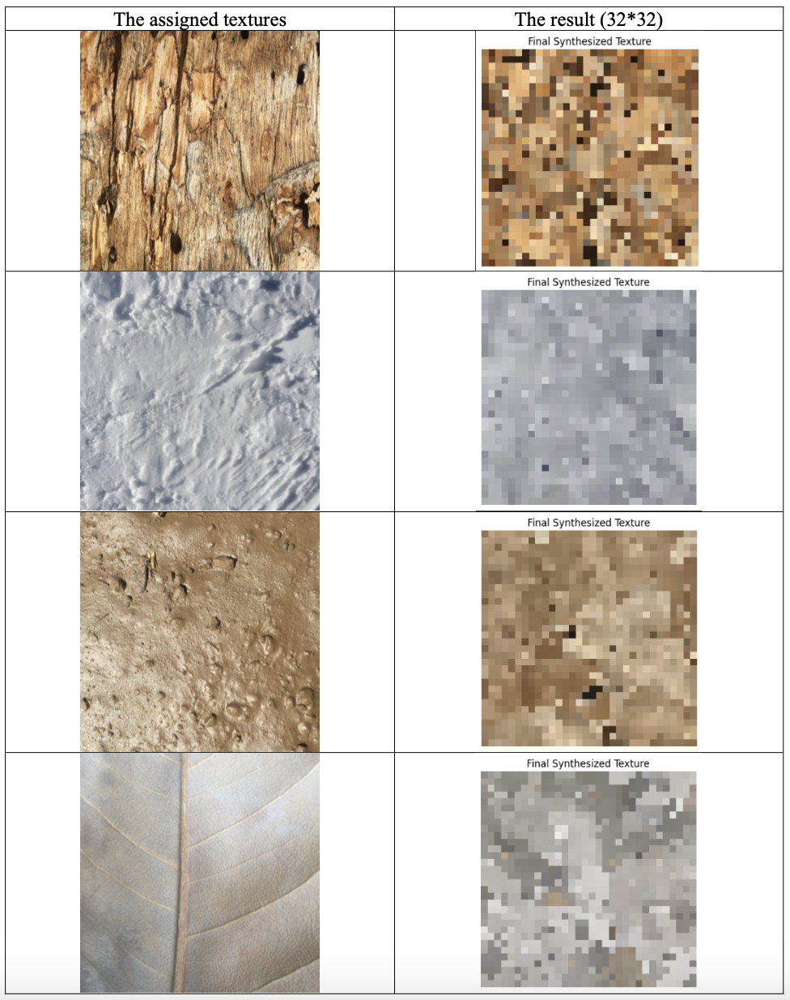
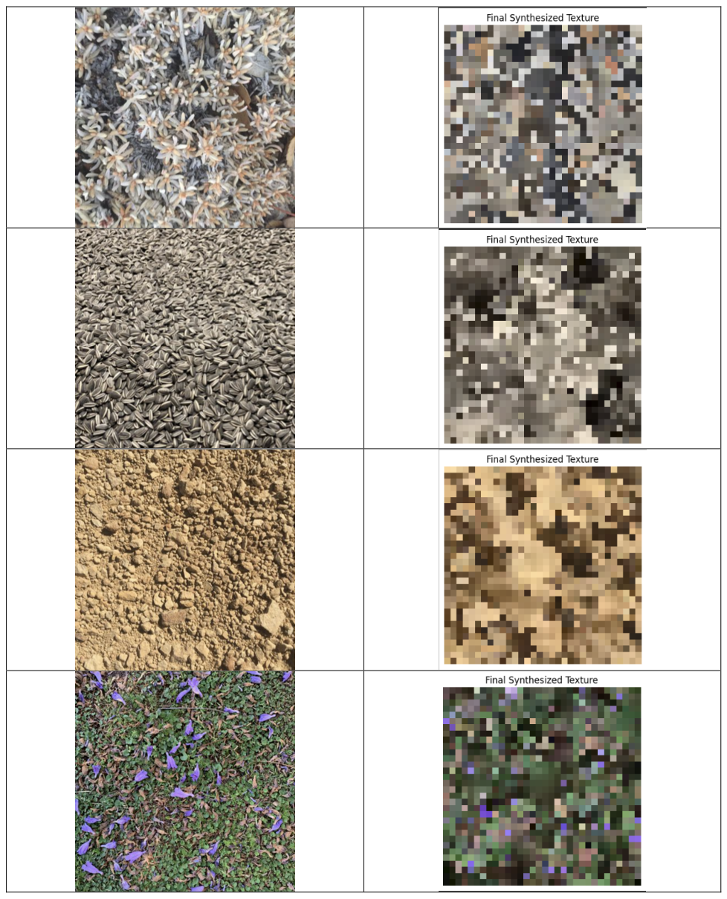
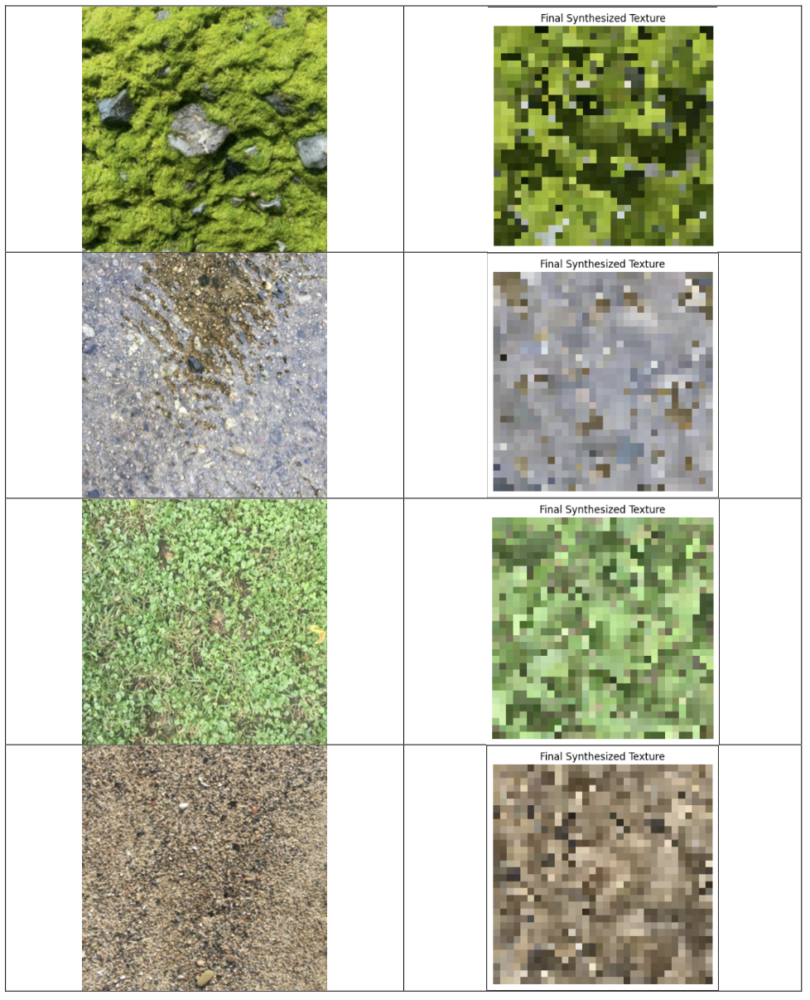
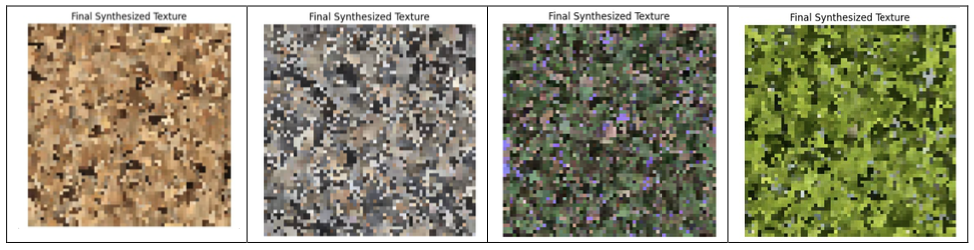
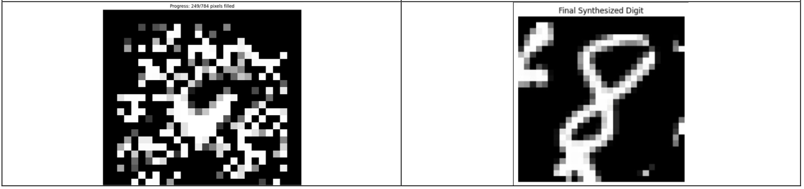

# 🖼️ Non-Parametric Data Synthesis – Efros & Leung (1999)

This project reproduces the classic **Efros & Leung (1999)** non-parametric texture synthesis algorithm, and then applies it to MNIST digit patches as an experimental extension.  
The method grows textures pixel-by-pixel without building an explicit model, instead sampling from neighborhoods in the source image.

📓 [View Code – Texture Synthesis](texture-synthesis.ipynb)  
📓 [View Code – MNIST Extension](mnist-extension.ipynb)

---

## 🧠 Method Overview

- **Efros & Leung algorithm** assumes a **Markov Random Field (MRF)** over pixels.  
- Each new pixel is synthesized by matching its known neighborhood to neighborhoods from the source texture.  
- The method is *non-parametric* (no explicit probability model) and relies on **direct sampling**.

**Key steps implemented:**
1. **Initialization** – Seed a small random patch in the output canvas.  
2. **Frontier detection** – Identify unfilled pixels adjacent to already synthesized ones.  
3. **Gaussian weighting** – Apply a Gaussian kernel to give higher weight to central pixels in the neighborhood.  
4. **Patch matching** – Compute Gaussian-weighted SSD between frontier neighborhoods and candidate patches.  
5. **Synthesis loop** – Iteratively copy the center pixel from a best-matching patch until the canvas is filled.  

---

## 🛠 Implementation Details

- **Input textures:** small sample textures provided in assignment.  
- **Output sizes:** 32×32 (main results) and 64×64 (selected tests).  
- **Runtime trade-off:** larger outputs produce finer textures but require more computation.  

**Findings:**
- 32×32 synthesis reproduces coarse texture structure.  
- 64×64 synthesis is slower but produces much more detailed, realistic results.  

---

## 🔢 MNIST Extension

- Extracted **9×9 patches** from MNIST digit **“8”**.  
- Seeded a blank 28×28 canvas with one random patch.  
- Grew the digit using the same frontier-based patch sampling as for textures.  

**Observations:**
- Small window sizes → incoherent digits, noisy results.  
- Sensitive to the **seed patch** (bad seeds → unrecognizable outputs).  
- Increasing the **window size** → generated outputs start to resemble valid digits.  
- Demonstrates the limitation: MNIST requires **global stroke continuity**, not just local texture consistency.  

---

## 📊 Results

### Texture synthesis (32×32 outputs)
Each assigned texture (left) with the synthesized 32×32 result (right):

   
   
  

---

### Texture synthesis (64×64 outputs)
Higher-resolution synthesis showing finer texture detail:

   
  <em>Efros & Leung synthesis at 64×64 resolution.</em>

---

### MNIST synthesis
- Poor seed/window choice → noisy digit-like blobs.  
- Improved seed + larger window → clearer digits.  

   
  <em>MNIST digit “8” synthesis – poor vs good initialization.</em>

---

## 📂 Project Structure
