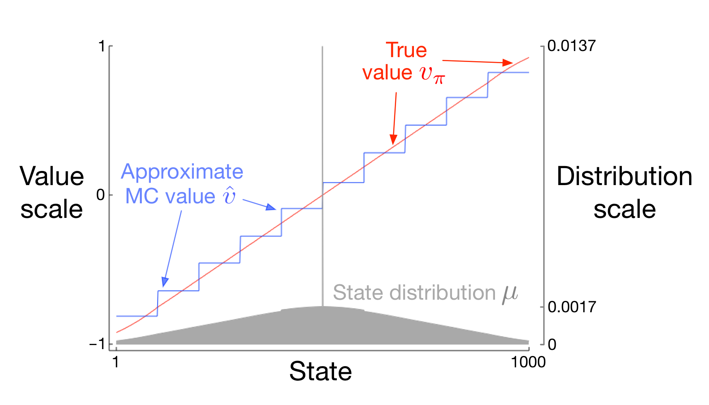
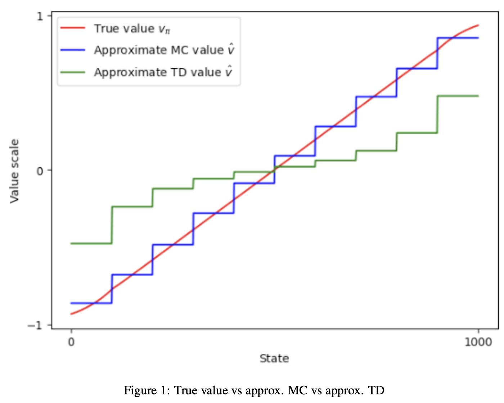

# 🔄 Random Walk – Gradient MC vs Semi-Gradient TD(0)

This project reproduces **Figure 9.1** from Sutton & Barto’s *Reinforcement Learning: An Introduction* using the **1000-state random walk** example.  
The goal is to compare **Gradient Monte Carlo (MC)** with **Semi-Gradient TD(0)** for value function approximation under state aggregation.

📓 [View Code](random-walk-approx.ipynb)

---

## 🧠 Problem Overview

- **Environment:** 1000-state random walk  
  - States: `1 … 1000`  
  - Terminals: `0` (left, reward = −1), `1001` (right, reward = +1)  
  - Start state: `500`  
- **Transitions:** from each state, move uniformly to one of the **100 neighboring states** (left or right).  
  - Near the edges, remaining probability mass goes to the corresponding terminal.  
- **Episodes:** 100,000  
- **Reward:**  
  - −1 at the left terminal  
  - +1 at the right terminal  
  - 0 otherwise  

- **State Aggregation:** the 1000 states are grouped into **10 groups of 100 states each**.

---

## 📐 Methods

- **True Value $v_\pi(s)$**  
  Computed using **iterative policy evaluation** with the known dynamics until convergence.

- **Value Function Approximation**  
  Using **linear function approximation with state aggregation**:
  - Each group of 100 states is represented by a one-hot feature vector.  
  - Both methods optimize weights $w$ with stochastic gradient descent on squared error.

---

## 🧪 Algorithms

- **Gradient Monte Carlo**  
  Uses full-episode returns as the target:  
  $ \Delta w = \alpha \,[\, G_t - \hat{v}(S_t, w) \,] \,\nabla \hat{v}(S_t, w) $

- **Semi-Gradient TD(0)**  
  Uses one-step TD target (bootstrapping):  
  $ \Delta w = \alpha \,[\, R_{t+1} + \gamma \hat{v}(S_{t+1}, w) - \hat{v}(S_t, w) \,] \,\nabla \hat{v}(S_t, w) $

- **Comparison**  
  - Gradient MC is unbiased but less efficient (updates only at episode end).  
  - Semi-Gradient TD(0) is more efficient (online updates) but introduces bias.

---

## ⚙️ Implementation Details

- **Episodes:** 100,000  
- **Step size:** $\alpha = 2 \times 10^{-5}$  
- **Discount:** $\gamma = 1$  
- **Policy:** uniform random walk  
- **Updates:** applied only to the weight of the active state group (due to one-hot features).  

---

## 📊 Results

Reference figure from the textbook (Example 9.1):

  

Results from the implementation:

  

- The **red line** shows the true value function $v_\pi$.  
- The **blue curve** shows Gradient Monte Carlo estimates.  
- The **green curve** shows Semi-Gradient TD(0) estimates.

